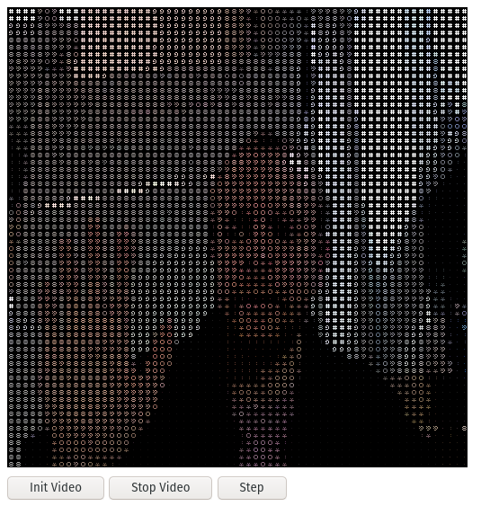

This is a direct implementation of [movAX13h's Shadertoy example](https://www.shadertoy.com/view/lssGDj). A pretty genious way of storing ASCII characters, as Bitmap's, as integers. See the demo of that [here](http://thrill-project.com/archiv/coding/bitmap/). Makes for a super simple shader implementation as you just sample the right pixel in the Bitmap to get the ASCII mask.
