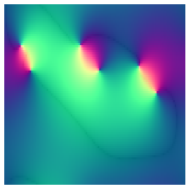

Implementing Alexander Mordvintsev's cell alignment [tutorial](https://youtu.be/dCDOFsgNnnQ) [from Shadertoy](https://www.shadertoy.com/view/3dtyW7). This took a lot longer than I expected as I'm still not exactly sure how Shadertoy deals with framebuffers. It seems like when I work with signed numbers and framebuffers I end up in a very-hard-to-debug situation, but Shadertoy handles it as you'd expect..

Also my mouse-zooming is a bit off for now.
