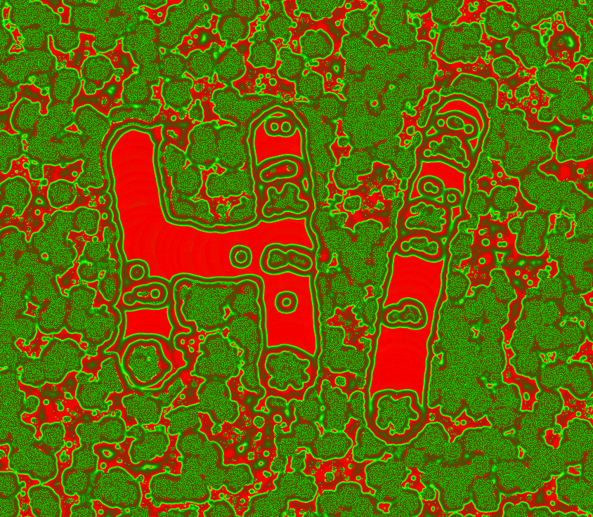

Turns outs the reaction diffusion algorithm (aka Gray Scott algorithm) is a lot simpler than I thought! This was much quick to implement than Hugo Elias' water ripple algorithm.

[Here is a good explanation](https://www.karlsims.com/rd.html) and [here is another implementation](https://github.com/pmneila/jsexp/blob/master/grayscott/index.html) which is slightly different.
