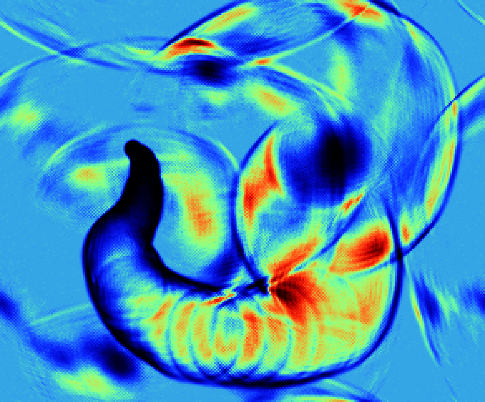

# Hugo Elias' Water Ripple Algorithm

A particularly elegant solution to simulating interfering ripples without any trigonometry. This is been implemented many times and there are many variations online, but for better or worse I gave it a crack based on the [original write-up](https://web.archive.org/web/20160116150939/http://freespace.virgin.net/hugo.elias/graphics/x_water.htm). I've spent too much time on this, turns out the biggest headache was keeping track of which textures you're reading from, and which you're writing to. This might serve as a useful reference for the kind of buffer arrangement often seen on [Shadertoy](https://www.shadertoy.com), but in plain WebGL. (You need 3 textures and 1 framebuffer).

I ended up using [this implementation](https://www.shadertoy.com/view/Xsd3DB) quite a lot and took quite a bit of the GLSL code from there.

> It's not strictly Elias' algorithm, as he says in his write up that he found it from some unnamed source, but his write up seems to have become the source for anyone looking to re-implement it and is name is often attributed to it.
